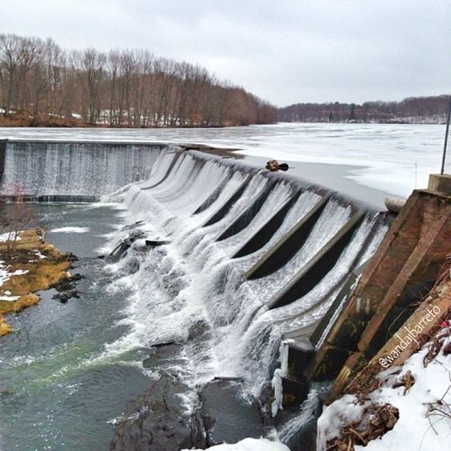

## [main](../README.md)

# Exposure

* Aperture

  * small number wider aperture: Ex f1.8 (brighter) will allow more light than f4.5 (darker)
* Shutter

  * smaller number means slow shutter speed - more light but can cause motion blurness
* ISO

  * smaller number means less light but less noise, use this only when Aperture and Shutter cant help to increase/decrease light
* 
* Light Meter
* Evaluative/Matrix Meter : Default : Check full image for brightness **Use in events**
  * Spot: Check brightness in specific spot **moon in darksky, dark dog in snowy day**
  * Center: Check brightness in center of photo **Portrait**
* Dynamic Range
  * image with bright (highlight) and dark(low light) in same photo.
  * Sunny day picture may have bright area and shadow will be dark, so HDR/Bracketing can help to improve the scene
  * once multiple exposed photo of same scene, will bring better highlight and low light, expose to shadow in 1 picture and expose to brightness area
    * HDR - High Dynamic Range photo
    * Bracketing - Multiple exposure for a same scene
* Histogram
  * will tell whether scene is over exposed or under exposed
  * left is shadow and right is highlights
  * so make sure graph is fat in center

### Assignment: Exposure Activity
* Go to three location, use manual mode and at different time to take picture and expose the images properly

* Location 1 : Union Pond Dam Side
  * Shutter mode: to get foam effect of water

    

  * Aperture Mode: to get same brightness but shutter speed is normal

    

* Location 2 : Union Pond Dock Side

  * ![Union Pond Dock Side]

* Location 3 : Union Pond Nevers Park Side

  * ![Union Pond Nevers Park Side]

* Extra: Try Hight Dynamic Range and merge the image using LR
## [main](../README.md)

